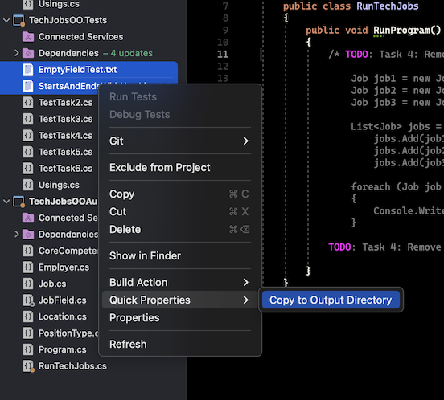

{}
Due to the fact that this code is being auto-graded as you work through it, make sure that you use any and all names for classes, variables, methods, etc provided to you in these directions.
{}

To display the data for a particular `Job` object, you need to implement a custom `ToString()` method. Rather than creating this method and then testing it, you will flip that process using TDD.

### Create First Test for `ToString()`

Before writing your first test, consider how we want the method to behave:
1. When passed a `Job` object, it should return a string that contains a blank line before and after the job information.

The string should contain a label for each field, followed by the data stored in that field. Each field should be on its own line.  There should be a new line between each job listing. 

   ```C# {linenos=true}

   ID:  _______
   Name: _______
   Employer: _______
   Location: _______
   Position Type: _______
   Core Competency: _______


   ID:  _______
   //... more job objects to follow
   ```

1. If a field is empty, the method should add, `“Data not available”` after the label.

We will need three tests to test our `ToString` method.

### Test 1: `TestToStringStartsAndEndsWithNewLine`

In `JobTests`, add a new test called `TestToStringStartsAndEndsWithNewLine` to check the first requirement (item 1 in the above list), then run that test (it should fail).


{}
Only run the unit tests in the `JobTests` class as you work through this Task.


If you were to run the auto-graded tests right now, you will not pass them even if your own unit tests pass.  Once you have all 3 unit tests completed, we will ask you to run the auto-graded tests.  Please make sure you are running the correct tests.
{}

### Code `ToString()` to Pass Test 1

In the `Job` class, create a `ToString()` method that passes the first test. Since the test only checks if the returned string starts and ends with a blank line, make that happen.

{}
Do NOT add anything beyond what is needed to make the test pass. You will add the remaining behaviors for `ToString()` as you code each new test.
{}

### Test 2: `TestToStringContainsCorrectLabelsAndData`

1. Code a new test for the second required behavior, then run the tests to make sure the new one fails. Call this test `TestToStringContainsCorrectLabelsAndData`.

1. Modify `ToString()` to make the new test pass. Also, make sure that your updates still pass all of the old tests.

1. Continue this test-refactor cycle until all of the behaviors we want for `ToString()` work. Remember to add only ONE new test at a time.

### Test 3: `TestToStringHandlesEmptyField`
1. Code your final test for the last required behavior, then run the tests to make sure the new one fails. Call this test `TestToStringHandlesEmptyField`.

1. Modify `ToString()` to make the new test pass. Also, make sure that your updates still pass all the old tests.

1. Cool! Your `Job` class is now complete and operates as desired.


### Run TestTask5 tests

Uncomment the tests inside the `TestTask5`class.  Look for the `TODO`s to help you find the multi-line comments marks.

Run your `TestTask5` unit tests. 

Refactor your code as needed. 

If the tests are failing, make sure you have uncommented the `TODO` in RunTechJobs.cs.

If you are getting a FileNotFound exception on the EmptyFieldTest.txt and StartsAndEndsWithNewLine.txt files:

>On Windows, right-click on the _EmptyFieldTest.txt_ file and choose _Properties_ from the context menu.  Under _Advanced_->_Copy to Output Directory_, change the setting to `Copy if newer`.  Repeat these steps for the _StartsAndEndsWithNewLine.txt_ file.
>
>
>
>
> 
>On Mac, you may select both of these files, right-click, choose _Quick Properties_, and then `Copy to Output Directory`.
>
>
>
>

Do not start Task 6 until you have passed all of Task 5’s auto-grading unit tests.

{}
Now would be a good time to save, `commit`, and `push` your work up to GitHub.
{}

On to [Task 6]().