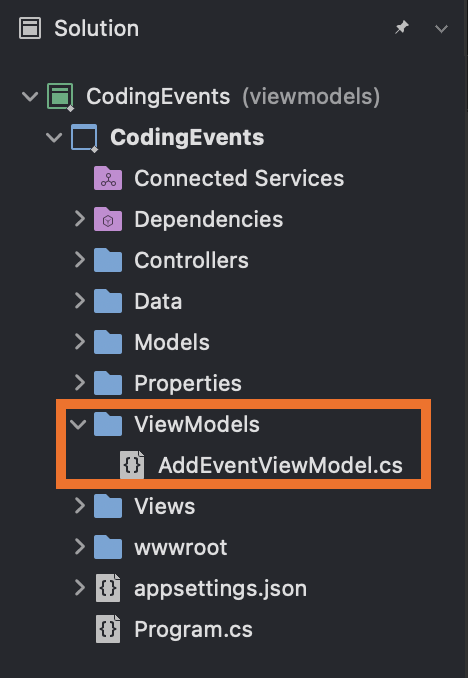

Now that we have an understanding for what a model is, we can focus on how to effectively pass information between the three elements of MVC applications. With our current MVC application, we can add new events and remove events. However, our application is also susceptible to run-time errors. Our view can accept any type of input and if we mistype something in our view, we can run into issues later down the line.

A `ViewModel` is a model class designed specifically to be used in a view. By utilizing ViewModels in our application, we can make our views strongly-typed and add validation to forms to prevent bad user input. Also, if we have information we want to collect as part of a form, but not save as part of a model, we can store that data as a property of a ViewModel. An example of this would be if we have a form for users to create an account on our site. The form includes two fields: one for the password and one for confirming the new user’s password. While we only want to save the password and may only have a `Password` property in our model, we can add a `ConfirmPassword` property to the `ViewModel` so we can check that the two match before saving the user’s info. These benefits of `ViewModels` will help reduce potential errors in our application.

## Refactoring the Project

To start with understanding why we may want to use a ViewModel, let’s refactor our code to use a model directly in our view. This will require some updates to our controllers and views.

We need to do the following steps:
1. [Create our new ViewModel]()
1. [Update the Model]()
1. [Update our Index Action Method]()
1. [Update the Index View]()
1. [Update the Add an New Event Action Methods]()
1. [Update the Add View Model]()

Let's get started!

### Creating a ViewModel

1. Add a `ViewModels` directory at the top level of the project.

1. Add a new class to the `ViewModels` directory and name it `AddEventViewModel`.


 


1. Add `Name` and `Description` properties to the new class.  We can remove the constructor. We do not need it at this time. 

1. We will need to declare the `Name` and `Description` as nullable.  You do this by using the nullable value type `?` after the modifiers.  To see these in action, look at lines 7 and 8 in the code block below.

   {} 
   ```csharp{linenos=table,hl_lines=[5,6],linenostart=3}
   namespace CodingEvents.ViewModels
   {
      public class AddEventViewModel
      {
         public string? Name { get; set; }
         public string? Description { get; set; }
      }
   }
   ```
   {}

   {}  
   
   **Declaring a Value Nullable**

   Do you see the `?` after `string` in lines 7 and 8 in the code block above? This declares this property to be a nullable value type. This means that the value of `Name` or `Description` is allowed to be null at some point.

   A null value for either of these fields is not idea, but we need them to have this flexibility when we begin to add validation attributes later in this chapter. If the validation checks fail, a new event will not be added to the project's data storage.  

  Check out these resources on [nullable value types](https://learn.microsoft.com/en-us/dotnet/csharp/language-reference/builtin-types/nullable-value-types#code-try-1) and [strategies](https://www.stevenbenitez.com/nullable-reference-type-strategies/) to handle them.


   We will declare our `Event` fields as nullable types, too.  See the next section below.
   {}

### Update the Model with Nullable Values

We need to declare the fields of our `Event` model nullable as well.

   {} 
   ```csharp{linenos=table,hl_lines=[5,6],linenostart=2}
   namespace CodingEvents.Models
   {
      public class Event
      {
		public string? Name { get; set; }
		public string? Description { get; set; }

      //code continues...
   ```
   {}

### Update the `Index` Action Method in the Controller

In the `EventsController`, find the `Index` action method.  We want to convert our `ViewBag` in to a `List` collection type.  

1. Update the `ViewBag.events` to a `List` of `Event` objects. Let's store this list in a variable called `events`. 

1. Pass the contents of the data layer to the new `List`.

1. Return the new list `events` to the View.

   {} 
   ```csharp{linenos=table,hl_lines=[],linenostart=19}
   // GET: /<controller>/
   public IActionResult Index()
   {
      List<Event> events = new List<Event>(EventData.GetAll());

      return View(events);
   }
   ```
   {}


### Update the `Index` View

Now that we are storing our items in a `List`, we need to import the model into our `Events/Index.cshtml` view so we can use the new events collection. We can start by adding a `@using` statement to let the view know which model to reference. We can also use the `@model` statement to let the view know which type of object to expect.  In this case, a list of `Event` objects.

1. Add a `@using` statement that informs the view about which portion of the project to access.
1. Add a `@model` statement to inform the view about the object type.

   {}
   ```csharp{linenos=table,hl_lines=[],linenostart=1}
   @using CodingEvents.Models
   @model List<Event>
   ```
   {}

1. Wherever we used our `ViewBag` property, we can now use `Model` syntax. We want to count the number of `Model` objects, like we did with the `ViewBag`. 

   {}
   ```csharp{linenos=table,hl_lines=[],linenostart=14}
   @if (Model.Count == 0)
   ```
   {}

1. We need to update the loop to check the `Model` for events (`evt`).

   {}
   ```csharp{linenos=table,hl_lines=[],linenostart=32}
   @foreach (var evt in Model)
   ```
   {}

Once the view has been updated, run the application!


### Update the `Add` and `NewEvent` Action Methods in the Controller

1. In the `EventsController`, add a `using` statement for your new ViewModel.

   {}
   ```csharp{linenos=table,hl_lines=[],linenostart=8}
   using CodingEvents.ViewModels;
   ```
   {}

1. In the `Add()` action method responsible for retrieving the form to add events, in `EventsController`, create a new instance of `AddEventViewModel` called `addEventViewModel` and pass it to the `View()`.

   {}
   ```csharp{linenos=table,hl_lines=[],linenostart=24}
   [HttpGet]
   public IActionResult Add()
   {
      AddEventViewModel addEventViewModel = new AddEventViewModel();

      return View(addEventViewModel);
   }
   ```
   {}


Next let's update our `NewEvent` action method.

1. Rename this method `Add()` and keep the parameters. 
1. Remove the `[Route]` attribute, but make sure to keep the `[HttpPost]` attribute.
1. It should take an instance of `AddEventViewModel` called `addEventViewModel` as a parameter.

   {}
   ```csharp{linenos=table,hl_lines=[],linenostart=29}
   [HttpPost]
   public IActionResult Add(AddEventViewModel addEventViewMode)
   ```
   {}

1. We want to create new events in this action method that we add to our data storage.
1. We are going to use new constructor syntax to create our `addEventViewModel` objects.
   1. We will create a new `Event` object called  `newEvent`.  
   1. We will instantiate all of the properties of Event using the `AddEventViewModel` inside curly braces `{ }`.
   1. We want to add our newEvent to our `EventData`.
   1. Finally, we want to return a redirected view back to the `/Events` view to see our newly added event.

   {}
   ```csharp{linenos=table,hl_lines=[],linenostart=29}
   [HttpPost]
   public IActionResult Add(AddEventViewModel addEventViewModel)
   {
      Event newEvent = new Event
      {
         Name = addEventViewModel.Name,
         Description = addEventViewModel.Description
      };

      EventData.Add(newEvent);

      return Redirect("/Events");
   }
   ```
   {}


You should how have two `Add()` methods. The framework is clever enough to know the difference.  The `[HttpPost]` attribute designates the `Add` method that processes the form while the other `Add()` method retrieves the form.

This is similar to how we created the `Delete()` action methods in the [previous chapter]().

{}

This renaming is not critical to your application, but can help you with the design logic of the program as it grows in size. 

{}

### Update the `Add` View

We are now ready to update our `Add` view.

1. Import the ViewModel to the `Add.cshtml` view with the necessary `@using` syntax. Inform the view that we will be using the new ViewModel with the correct `@model` syntax.

   {}
   ```csharp{linenos=table,hl_lines=[],linenostart=1}
   @using CodingEvents.ViewModels
   @model AddEventViewModel
   ```
   {}

   We are going to add [anchor tags helpers](https://learn.microsoft.com/en-us/aspnet/core/mvc/views/tag-helpers/built-in/anchor-tag-helper?view=aspnetcore-7.0) to the form. 

1. Add `asp-controller = Events` and `asp-action = Add` to the `<form>` tag to designate which method the form data should be sent to.  We want our form to send data to the `Add` method that handles `POST` requests inside the `Events` controller.

1. Add `asp-for` to `<label>` and `<input>` tags. This allows us to specify which form field corresponds to which property in our ViewModel.

   {}
   ```csharp{linenos=table,hl_lines=[],linenostart=6}
   <form asp-controller="Events" asp-action="Add" method="post">
      <div class="form-group">
         <label asp-for="Name"></label>
         <input asp-for="Name" />
      </div>
      <div class="form-group">
         <label asp-for="Description"></label>
         <input asp-for="Description" />
      </div>
      <input type="submit" value="Add Event" />
   </form>
   ```
   {}

   {}

   In the code block above, notice the lines where we use `asp-for`.  We removed the `name` and `type` requirements from the `<input>` type and added `asp-for` to the `<label>` tag too. `asp-for` reflects the name we provided to the property in the ViewModel.  The reflected name will be used in the view when we run this project.

   {}

1. Run your application.  
   1. Test what happens when you provide input in each box.  
   1. Test what happens when you leave one empty.  
   1. Finally, test what happens when you leave all of them blank.  Looks like the app would benefit from some validation.

## Recap for the Refactor

This was merely a refactor so the functionality of the app hasn’t changed, but we have eliminated some of the possibility of bugs in our code being discovered at runtime! Using a model in a view like this makes our view _strongly-typed_. Before if we misspelled a property of `Event` or `ViewBag`, those errors would have been caught at run-time and possibly interfered with users’ experience. With a strongly-typed view, the same errors would be caught at compile-time before users see the application. Strongly-typed views also support intellisense, so as we work with properties of a model, we can make sure we have the correct property name.


While the functionality of the application remains the same, we are now in a position to easily add validation to our application.  

## Check Your Understanding
{} 
**True or False**: ViewModels are views designed to specifically be used in models.

<!-- ans: False, ViewModels are models designed to be used in views! -->
{}
